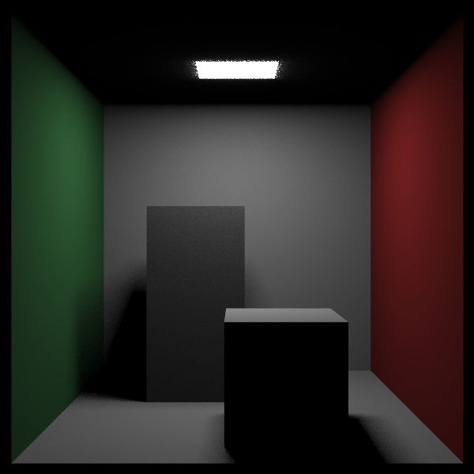

# CUDA_RayTracing
This project is largely inspired by [ray tracing in one weekend/ the following week](raytracing.github.io), and will try to further implement further more algorithms included in the [the rest of your life](raytracing.github.io). 
A simple pdf function and Monte-Carlo is now implemented, waiting to implement more complex version.
# How to run
This project is implemented on windows(visual studio 2019), so just clone the repo and run it.(don't forget to check your CUDA toolkit version is 11.4!)
